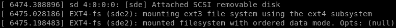

# Intel Cyclone V (Terasic DE1-SoC) evaluation

This folder contains the files for reproducing the test bench used for assessing the performance of the high-performance on-chip interfaces of the Intel Cyclone V device (Terasic DE1-SoC board).


## Content of this folder

* `./bin/` contains the raw binary files required to program the FPGA for all the twelve tested hardware configurations (so that there is no need for recompiling the designs).
* `./hw/` contains the project files required to recriate the projects used to produce the files in `./bin/`.
* `./sdcard/` contains the files to be written to the SD card by the automatic script.
* `./sw/` contains the source code of the applications to be executed on the device.
* `./create_linux_system.sh` is a script that automatically partitions the SD card and writes the required files to configure the FPGA at boot time and run the Linux operating system.

## Requisites

1. Host PC running Windows or Linux (preferably Linux);
2. Terasic DE1-SoC board;
3. Micro-SD card with at least 1 GB.
4. Quartus Prime 18.1 **(both Lite and Standard versions are supported)**.

## Implementing a project

All the projects inside this folder can be implemented using the same method. The implementation of the project contained in `./hw/duplex_32bit/` is demonstrated below. In case you are interested in exploring the project files, follow all the steps below. Otherwise you can skip steps 1 through 5.

1. Make sure that the intelFPGA tools are in your `$PATH`. For example, in my case, I source the following script.
```
VERSION=18.1
INSTALL_DIR=/opt/intelFPGA

# quartus
export PATH=$INSTALL_DIR/$VERSION/quartus/bin:$PATH
export LM_LICENSE_FILE=<port@server>

# arm ds
SOCEDS_DEST_ROOT=$INSTALL_DIR/$VERSION/embedded
QUARTUS_ROOTDIR=$INSTALL_DIR/$VERSION/quartus
source $INSTALL_DIR/$VERSION/embedded/env.sh
```
2. Launch an embedded command shell. For doing so, execute the script `<intelFPGA install dir>/embedded/embedded_command_shell.sh`.
3. Launch Intel Quartus Prime and open the project by selecting *File*, *Open Project*. Select the file `./hw/duplex_32bit/quartus/DE1_SoC_demo.qpf`.
4. You can access the top `.vhd` file by double clicking on *DE1_SoC_top_level* under *Project Navigator*.
5. You can analyze the architecture hierarchy of the system using the *Platform Designer* tool within Quartus Prime. Select *Tools*, *Platform Designer* and open the file `./hw/duplex_32bit/quartus/soc_system.qsys`. You should see the content shown below. There is no need to change anything or reimplement the project, since all the required files were already produced. Thus, when you are done analyzing the architecture, close both the Platform Designer and Quartus Prime and proceed for the next step.

6. Connect the micro-SD card to your computer using a card reader and find out the name assigned by the operating system. When using Linux, this information can be obtained through the command `dmesg`. For instance, in my case, I obtained the following output, therefore my micro-SD card identifier is `/dev/sde`.

7. Copy the raw binary file to the `./sdcard/` directory.
```
cp bin/duplex_32bit/socfpga.rbf sdcard/fat32/
```
8. Copy the header file to the `./sw/` directory.
```
cp bin/duplex_32bit/hps_soc_system.h sw/hps/application/
```
9. Write files to the SD card by executing the script `./create_linux_system.sh` followed by the identifier found on step 6 (on the example below, `/dev/sde` is used). **Note that this script requires root priviledges. Make sure that the micro-SD card identifier is correct. Indicating a wrong identifier may erase your hard drive permanently. All the data stored in the micro-SD card will be permanently erased.**
```
sudo ./create_linux_system.sh /dev/sdX
```
10. Remove the micro-SD card from your computer and plug it to the board.
11. Set the *MSEL* switches under the board to `000000`, as shown bellow.

12. Connect the board to the computer through the UART interface (black cable in the upper right corner), to an internet router through the ethernet interface (yellow cable), and to the power source using the power cord. Note that the white cable in the picture connects the USB blast interface to the computer, allowing to program the FPGA using Quartus Prime. It will not be required in this case.
.
13. Turn on the power switch on the board and run `dmesg` to find the name of the UART interface (in my case, I have got `/dev/ttyUSB0`). If at this point you open a serial console and see no output, do not worry. The first boot is used to set up the Linux shell on the serial interface.
14. Cold reboot the board.
15. Start a serial console using, for example, the `screen` command.
```
sudo screen /dev/ttyUSB0 115200
```
16. You have now a fully operational Linux operating system running on the board. Login using the username `root` and password `1234`. Check that the board is connected to the internet **(very important since you will have to install some packages)** by running the command `ping 8.8.8.8`. Run the script `./config_post_install.sh` and reboot the board after it finishes through writing the command `reboot` in the command line.
17. Launch the DS-5 Development Studio through the command `eclipse`. Select any directory of your liking as the workspace.
18. Create a new C project by selecting *File*, *New*, *C Project*.
    1. Use *DE1_SoC_demo_hps_linux* as the project name.
    2. Disable the *Use default location* checkbox.
    3. Set `./sw/hps/application` as the target location for the project.
    4. Select *Executable*, *Empty Project* as the project type.
    5. Choose *GCC 4.x [arm-linux-gnueabihf] \(DS-5 built-in)*