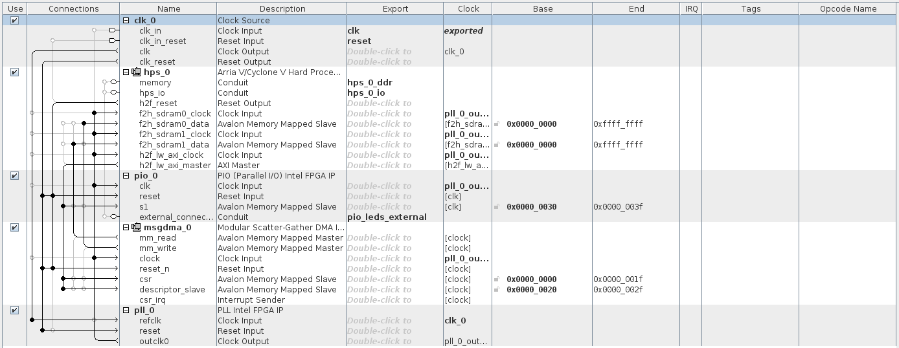

# Intel Cyclone V (Terasic DE1-SoC) evaluation

This folder contains the files for reproducing the test benches used for assessing the performance of the high-performance on-chip interfaces of the Intel Cyclone V device (Terasic DE1-SoC board).


The evaluation methodology using the DE1-SoC board consisted of implementing a hardware system in the FPGA capable of fully exploiting the high-performance on-chip interfaces between the Hard Processor System and the FPGA. The software component of the artifact is a Linux C application that controls and synchronizes data transfers through the Direct Memory Access engine implemented on the FPGA.

**I thank [Sahand Kashani](https://github.com/sahandKashani) for his contribution to this project.** For those who are interested in learning the development flow of Intel devices, I recommend reading [Sahand's SoC-FPGA Design Guide (DE1-SoC Edition)](https://github.com/sahandKashani/SoC-FPGA-Design-Guide/blob/master/DE1_SoC/SoC-FPGA%20Design%20Guide/SoC-FPGA%20Design%20Guide%20%5BDE1-SoC%20Edition%5D.pdf). I also thank him for sharing his software wrapper for the Intel Modular Scatter-Gatter Direct Memory Access (MSGDMA) engine, to easily program and control the MSGDMA device.

## Content of this folder

* `./bin/` contains the raw binary files required to program the FPGA for all the twelve tested hardware configurations (so that there is no need for recompiling the designs).
* `./hw/` contains the project files required to recreate the projects used to produce the files in `./bin/`.
* `./sdcard/` contains the files to be written to the SD card by the automatic script.
* `./sw/` contains the source code of the applications to be executed on the device.
* `./create_linux_system.sh` is a script that automatically partitions the SD card and writes the required files to configure the FPGA at boot time and run the Linux operating system.

## Requisites

1. Host PC running Windows or Linux (preferably Linux);
2. Terasic DE1-SoC board;
3. Micro-SD card with at least 1 GB.
4. Quartus Prime 18.1 **(both Lite and Standard versions are supported)**.

## Implementing a project

All the projects inside this folder can be implemented using the same method. The implementation of the project contained in `./hw/duplex_32bit/` is demonstrated below. In case you are interested in exploring the project files, follow all the steps below. Otherwise, you can skip steps 1 through 5.

1. Make sure that the Intel FPGA tools are in your `$PATH`. For example, in my case, I source the following script.
```
VERSION=18.1
INSTALL_DIR=/opt/intelFPGA

# quartus
export PATH=$INSTALL_DIR/$VERSION/quartus/bin:$PATH
export LM_LICENSE_FILE=<port@server>

# arm ds
SOCEDS_DEST_ROOT=$INSTALL_DIR/$VERSION/embedded
QUARTUS_ROOTDIR=$INSTALL_DIR/$VERSION/quartus
source $INSTALL_DIR/$VERSION/embedded/env.sh
```
2. Launch an embedded command shell. For doing so, execute the script `<intelFPGA install dir>/embedded/embedded_command_shell.sh`.
3. Launch Intel Quartus Prime and open the project by selecting *File*, *Open Project*. Select the file `./hw/duplex_32bit/quartus/DE1_SoC_demo.qpf`.
4. You can access the top `.vhd` file by double-clicking on *DE1_SoC_top_level* under *Project Navigator*.
5. You can analyze the architecture hierarchy of the system using the *Platform Designer* tool within Quartus Prime. Select *Tools*, *Platform Designer* and open the file `./hw/duplex_32bit/quartus/soc_system.qsys`. You should see the content shown below. There is no need to change anything or reimplement the project since all the required files were already produced. Thus, when you are done analyzing the architecture, close both the Platform Designer and Quartus Prime and proceed for the next step.

6. Connect the micro-SD card to your computer using a card reader and find out the name assigned by the operating system. When using Linux, this information can be obtained through the command `dmesg`. For instance, in my case, I obtained the following output, therefore my micro-SD card identifier is `/dev/sde`.
```
[ 6474.308896] sd 4:0:0:0: [sde] Attached SCSI removable disk
[ 6474.028186] EXT4-fs (sde2): mounting ext3 file system using the ext4 subsystem
[ 6474.198483] EXT4-fs (sde2): mounted filesystem with ordered data mode. Opts: (null)
```
7. Copy the raw binary file to the `./sdcard/` directory.
```
cp bin/duplex_32bit/socfpga.rbf sdcard/fat32/
```
8. Copy the header file to the `./sw/` directory.
```
cp bin/duplex_32bit/hps_soc_system.h sw/hps/application/
```
9. Write the files to the micro-SD card by executing the script `./create_linux_system.sh` followed by the identifier found in step 6 (on the example below, `/dev/sde` is used). **Note that this script requires root privileges. Make sure that the micro-SD card identifier is correct. Indicating a wrong identifier may erase your hard drive permanently. All the data stored in the micro-SD card will be permanently erased.**
```
sudo ./create_linux_system.sh /dev/sde
```
10. Remove the micro-SD card from your computer and plug it to the board.
11. Set the *MSEL* switches under the board to `000000`, as shown below.

12. Connect the board to the computer through the UART interface (black cable in the upper right corner), to an internet router through the ethernet interface (yellow cable), and to the power source using the power cord. Note that the white cable in the picture connects the USB blast interface to the computer, allowing to program the FPGA using Quartus Prime. It will not be required in this case.

13. Turn on the power switch on the board and run `dmesg` to find the name of the UART interface (in my case, I have got `/dev/ttyUSB0`). If at this point you open a serial console and see no output, do not worry. The first boot is used to set up the Linux shell on the serial interface.
    1. If you get an error during boot, try cold rebooting the board. When you see the text *Hit any key to stop autoboot:*, press enter and run the following commands.
    ```
    env default -a
    saveenv
    ```
14. Cold reboot the board.
15. Start a serial console using, for example, the `screen` command.
```
sudo screen /dev/ttyUSB0 115200
```
16. You have now a fully operational Linux operating system running on the board. Log in using the username `root` and password `1234`. Check that the board is connected to the internet **(very important, since you will have to install some packages)** by running the command `ping 8.8.8.8`. Run the script `/config_post_install.sh` and reboot the board after it finishes through writing the command `reboot` in the command line.
17. Launch the DS-5 Development Studio through the command `eclipse`. Select any directory of your liking as the workspace.
18. Create a new C project by selecting *File*, *New*, *C Project*.
    1. Use *DE1_SoC_demo_hps_linux* as the project name.
    2. Disable the *Use default location* checkbox.
    3. Set `./sw/hps/application` as the target location for the project.
    4. Select *Executable*, *Empty Project* as the project type.
    5. Choose *GCC 4.x [arm-linux-gnueabihf] \(DS-5 built-in)* as the toolchain.
    6. Your configuration should look like the one below. Press the *Finish* button. If you are asked if you want to override a previous configuration, go ahead and press *Ok*.
    
19. For the toolchain to successfully compile the project, some configurations have to be done and some files and libraries have to be linked.
    1. Righ-click on *DE1_SoC_demo_hps_linux* under *Project Explorer* and select *Properties*.
    2. Under *C/C++ Build*, *Settings*, *GCC C Compiler 4 [arm-linux-gnueabihf]*, *Dialect*, select *ISO C99 (-std=c99)* as language standard.
    3. Under *C/C++ Build*, *Settings*, *GCC C Compiler 4 [arm-linux-gnueabihf]*, *Preprocessor*, add *soc_cv_av* to the *Defined symbols (-D)* list.
    4. Under *C/C++ Build*, *Settings*, *GCC C Compiler 4 [arm-linux-gnueabihf]*, *Includes*, add the following paths to the *Include paths (-I)* list.
        - `<intelFPGA install dir>/embedded/ip/altera/hps/altera_hps/hwlib/include`.
        - `<intelFPGA install dir>/embedded/ip/altera/hps/altera_hps/hwlib/include/soc_cv_av`.
	5. Under *C/C++ Build*, *Settings*, *GCC C Linker 4 [arm-linux-gnueabihf]*, *Libraries*, add *m* to the *Libraries (-l)* list.
    6. Build the project by right-clicking on *DE1_SoC_demo_linux*, *Build Project*.
20. On the serial terminal (where you have the board's command prompt), type `ifconfig eth0 | grep inet` to obtain the board's IP address. You should obtain an output like the one below, indicating that the IP address of the board (in this case) is *10.0.1.194*.
```
root@DE1-SoC:~# ifconfig eth0 | grep inet
          inet addr:10.0.1.194  Bcast:10.0.255.255  Mask:255.255.0.0
          inet6 addr: fe80::50a6:83ff:fefa:8b3e/64 Scope:Link
```
21. Create an SSH remote connection to the board.
    1. Select *File*, *New*, *Other...*, *Remote System Explorer*, *Connection*, *Next*, *SSH Only*, *Next*.
    2. Set the hostname to the IP address you have found on step 20. Set the connection name to *DE1-SoC*, and click on *Finish*.
22. Right-click on the *DE1_SoC_demo_linux* project and select *Debug As*, *Debug Configurations...*.
    1. Create a new debugger by right-clicking on *DS-5 Debugger*, *New*. Use *DE1_SoC_demo_hps_linux* as the name of the debug configuration.
    2. Under the *Connection* tab, select *Altera*, *Cyclone V (Dual-Core)*, *Linux Application Debug*, *Download and debug application* as the target platform. Set the *RSE connection* to *DE1-SoC*.
    3. Under the *Files* tab, set the *Application on host to download* to `${workspace_loc:/DE1_SoC_demo_hps_linux/Debug/DE1_SoC_demo_hps_linux}`. Set both the *Target download directory* and *Target working directory* to `/root/`.
    4. Under the *Debugger* tab, make sure that *Debug from symbol* is selected and that *main* is the name of the symbol.
    5. Click on the *Apply* button and then *Close*.
23. Switch to the *DS-5 Debug* perspective by clicking on the bug icon on the top right corner.
24. Under *Debug Control*, select *DE1_SoC_demo_hps_linux* and click on *Connect to target*. Authenticate using `root` as the user ID and `1234` as the password.
25. Click on *Continue (F8)* or press F8 to execute the application. You will see the output produced by the device in the *Target Console*. If all went well, you should see an output similar to the one below.
```
* MEM TRANSFER TYPE: duplex
* DATA BLOCK SIZE: 32 MiB
* CHANNEL WIDTH: 32-bit
* N RUNS: 200

AVERAGE [MB/s]: 799.6088
MINIMUM [MB/s]: 799.3909
MAXIMUM [MB/s]: 799.8673
STANDARD DEVIATION [MB/s]: 0.0678
```
