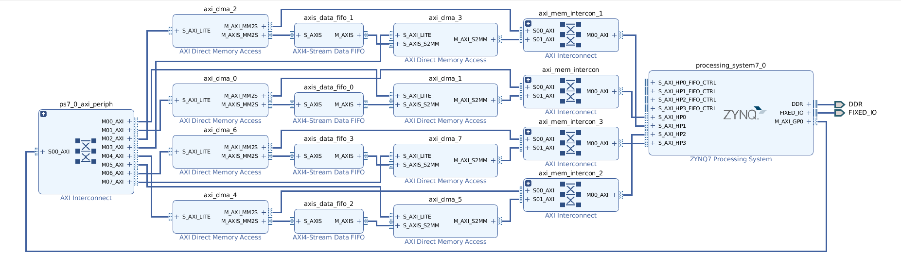

# Xilinx 7010 (Digilent Zybo board) evaluation

This folder contains the files for reproducing the test bench used for assessing the performance of the high-performance on-chip interfaces of the Xilinx ZYNQ 7010 device (Digilent Zybo board).

## Requisites

1. Host PC running Windows or Linux (preferably Linux);
2. Digilent Zybo board **(not Zybo Z7)**;
3. Xilinx Vivado 2018.3 **(other versions of Vivado were not tested and may not be supported)**.

## Implementing a project

All the projects inside this folder can be implemented using the same method. The implementation of the project contained in `./hw/duplex_32bit/` is demonstrated below.

1. Open Vivado 2018.3 and select *Open Project*. Navigate to `./hw/duplex_32bit/` and open the file named `BandwidthAssessment.xpr`.
2. There is no need to do anything in Vivado, since the project was already synthesized, implemented and the bitstream generated. Nevertheless, feel free to explore the design by selecting *IP INTEGRATOR*, *Open Block Design*. In the case of this project, you will see the top architecture below.

3. After you are done exploring the architecture, launch Vivado SDK by selecting *File*, *Launch SDK*.